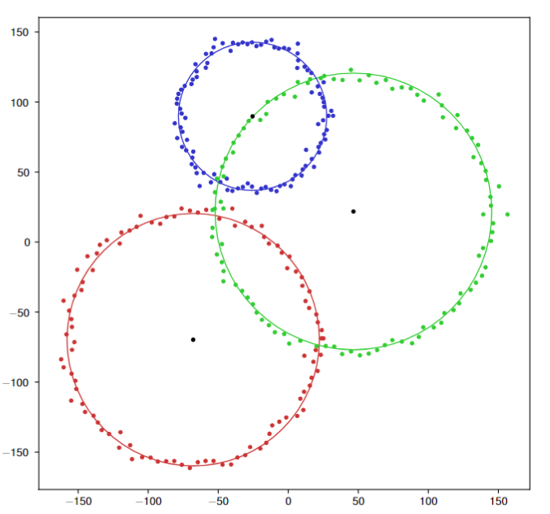

# Noisy Rings Clustering 💍

<div align="center" style="margin: auto; width: 100%;" width="100%"></div>

This repository contains the code and report for the final project of the course "Artificial Intelligence" at the University of Seville. The statement of the project can be found in the `statement` folder.

TL;DR: The project consists of implementing a clustering algorithm that can cluster data that is distributed in rings, in a noisy environment.

## Installation

The requirements for the project are listed in the `requirements-*.txt` files. To install them, you can use pip:

```bash
pip install -r requirements-*txt

```

where `*` corresponds to each submodule (experiments, library, app).
The development was done using Python 3.11, but it should work with any modern Python 3 version.

## Library

The main algorithm is presented in the form of a library under the `nrc` folder. It exports the NoisyRingsClustering class and NOISE constant.
The public interface of the class is as follows:

- fit(self, x: np.ndarray) -> None -- Fit the algorithm to the data. Data must be a 2D numpy array, with shape (n_samples, 2).
- get_labels(self) -> Tuple[np.ndarray, np.ndarray, np.ndarray] -- Get the labels of the data. Returns a tuple with the hard labels, the centers of the clusters and the radii of the clusters.

For more concrete information, refer to the docstrings of each method.
The package includes other methods/classes for private usage.
The `NOISE` constant is used to represent the noise label. It is set to -1.
The `experiments` section contains examples of how to use the library.

## Report

Report is available in the `report` folder. It is written in LaTeX and can be compiled using a compatible LaTeX compiler.

## Experiments

Multiple experiments were conducted to test the algorithm, and the results are available on the paper.
To experiment with the algorithm, you can use the `experiments/experiment_playground.ipynb` notebook. It allows to generate random data based on your input,
run the algorithm and visualize the results. It also allows to save the experiment results to a file, to be benchmarked later. Furthermore, it allows to save
the figures as `pgf` files, to be included in a LaTeX document.

To rerun an individual experiment that was saved earlier, you can use the `experiments/run_experiment.ipynb` script. It allows to run an giving it subfolder and name. It also allows to save the plots as `pgf` files.

Experiments are saved in the `experiments/experiments` folder. Each family of experiments is saved into a subfolder, for example `experiments/experiments/test_this`. Each experiment file is saved as a `.json` file, and contains parameters that, with a fixed seed, allow to reproduce the experiment (both with the run_experiment script and the benchmarking script). The generated data is saved under `experiments/data/subfolder`, in csv files. Each experiment json file contains the path to the data file, so it can be loaded and used to run the algorithm.

### Benchmarking

To benchmark the algorithm, you can use the `experiments/benchmark.py` script. It takes as argument `cfg`, which is the family of experiments to benchmark. It will run all the experiments in the family, print out a table with the results, and save a `results.txt` file with a LaTeX table that can be included in the report.

In order to include a new benchmarking family, it must be added to the start of the code (it is a configuration dictionary that includes what to include in the printed table and the results.txt file). The benchmarking script will run all the experiments in the family, and print out the results in a table.

To benchmark all families of experiments:

```bash
 python -m experiments.benchmark --cfg=general
 python -m experiments.benchmark --cfg=bg_noise
 python -m experiments.benchmark --cfg=concentric
 python -m experiments.benchmark --cfg=needle_in_haystack
```

There are other helper files designed for the experiments specifically.

## App

Demo web app that uses `streamlit` to visualize the algorithm through a simple web app. To run the app, use the following command:

```bash
streamlit run app/app.py
```

The usage is intuitive, just fill in the different parameters and click on the "Run" button. The app will generate and display the data, as well as the clustering results.

## License

This project is licensed under the MIT License - see the [LICENSE](LICENSE) file for details.
